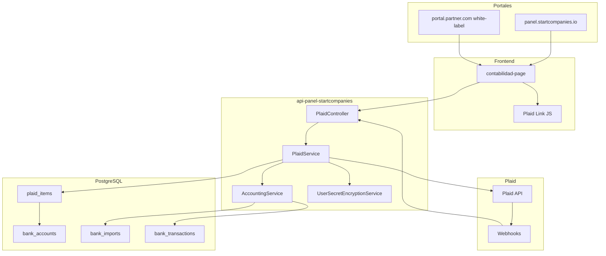
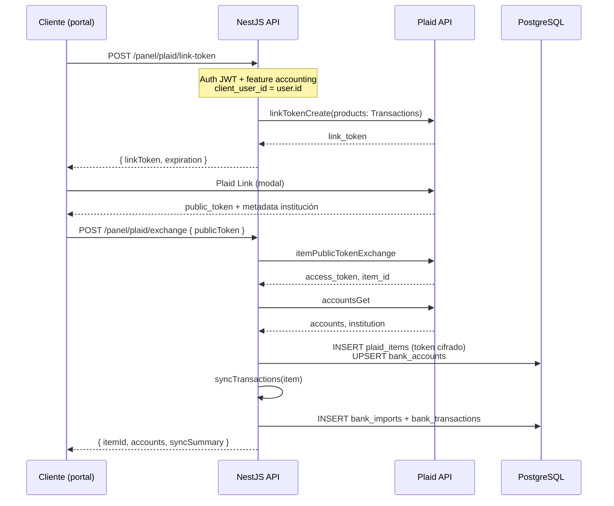
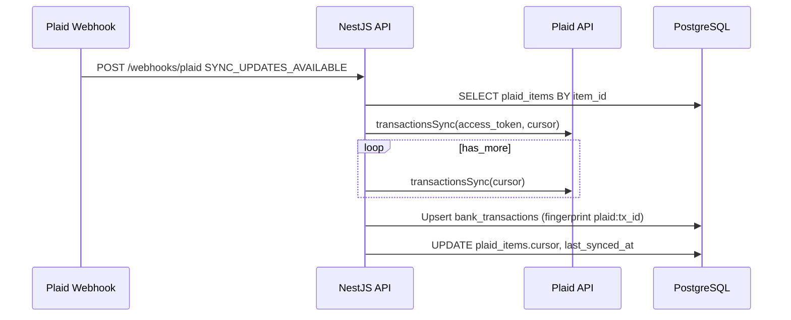

# Sincronización bancaria con Plaid — contabilidad

Especificación del flujo a implementar para conectar cuentas bancarias vía [plaid-node](https://github.com/plaid/plaid-node) y alimentar el módulo de contabilidad existente, reemplazando o complementando la importación manual de CSV.

**Alcance principal:** sincronizar movimientos bancarios de **todos los clientes finales** (`type=client`) que usan contabilidad — tanto en el portal Start Companies como en portales white-label de partners — mediante **autogestión**: cada cliente conecta su propio banco en `/contabilidad`.

**Estado:** diseño / pendiente de implementación.

---

## 1. Objetivo

Permitir que cada **cliente del panel** (`users.type = 'client'`) conecte su banco desde `/contabilidad` y reciba movimientos en `bank_transactions` de forma automática, reutilizando:

- Clasificación por reglas e IA (`AccountingClassificationService`, feature `accountingAi`)
- P&L en base efectivo (`AccountingService.profitAndLoss`)
- Reglas por payee (`user_classification_rules`)

La importación CSV **sigue disponible** como respaldo cuando Plaid no cubra el banco o el cliente prefiera subir extractos manualmente.

---

## 2. Contexto actual en el código

| Pieza | Ubicación | Rol hoy |
|-------|-----------|---------|
| Importación CSV | `POST /panel/accounting/imports/csv` | Entrada principal de movimientos |
| Vista contabilidad | Portal Angular `contabilidad-page` | Solo rol `client`, feature `accounting` |
| Cuenta bancaria lógica | `bank_accounts.owner_user_id` | Agrupa imports por cliente |
| Import batch | `bank_imports` | Una fila por CSV o sync |
| Movimiento | `bank_transactions.fingerprint` | Dedupe SHA1 (CSV) o `plaid:{transaction_id}` (Plaid) |
| Pagos | `StripeService` | Patrón de referencia para SDK externo + webhooks |
| Banco Lili | `LiliModule` | Apertura de cuenta (leads), **no** transacciones |
| Cifrado secretos | `UserSecretEncryptionService` | AES-256-GCM con `USER_SECRETS_ENCRYPTION_KEY` |

**Convención de montos en contabilidad:**

- Monto **positivo** → ingreso / depósito (`isIncome: amt > 0`)
- Monto **negativo** → gasto / salida

Plaid (cuentas de depósito) usa la convención **inversa**: positivo = salida, negativo = entrada. Al importar desde Plaid hay que **invertir el signo** (`amount = -plaidTx.amount`).

---

## 3. Actores y quién conecta el banco

**Regla única:** quien conecta el banco es siempre el **cliente final** (`users.type = 'client'`), con sus propias credenciales bancarias en Plaid Link. Esto aplica por igual a clientes de Start Companies y a clientes de partners white-label. El partner y el admin **no** conectan bancos en nombre de terceros.

### 3.1 Clientes finales con contabilidad (SC y partners — mismo flujo)

| Actor | Portal | `clients.partner_id` | ¿Conecta banco vía Plaid? |
|-------|--------|----------------------|---------------------------|
| Cliente SC directo | Host plataforma (`panel.startcompanies.io`) | `NULL` | **Sí** — `/contabilidad` → «Conectar banco» |
| Cliente del partner | Dominio white-label del tenant | `partner.id` | **Sí** — mismo UI y mismos endpoints que cliente SC |
| Cliente invitado al portal | Plataforma o tenant (según invitación) | según `clients` | **Sí** — idéntico una vez tiene usuario `client` |

**Flujo (idéntico en ambos casos):**

1. El cliente inicia sesión en su portal (SC o white-label).
2. Entra a `/contabilidad` (rol `client`, feature `accounting`).
3. Pulsa «Conectar banco» y completa Plaid Link con **su** banco.
4. Los movimientos quedan bajo `bank_accounts.owner_user_id = client.id`.

La única diferencia entre cliente SC y cliente partner es **cosmética/tenant**: host del portal, branding del Link (`client_name`) y scope de la clave Gemini para IA post-sync. **No** hay flujo distinto ni permisos especiales para que el partner intervenga en la conexión.

### 3.2 Partner y staff (sin conexión Plaid propia)

| Actor | `users.type` | ¿Tiene `/contabilidad`? | ¿Conecta bancos de clientes? |
|-------|--------------|-------------------------|------------------------------|
| Partner | `partner` | No | **No** — sus clientes se conectan solos |
| Staff SC | `user` / `admin` | No (como cliente) | **No** — no abre Plaid Link por terceros |

El partner gestiona clientes (altas, import CSV de LLCs, etc.) pero **no** sustituye al cliente en Plaid. Si un cliente del partner aún no conectó el banco, el partner puede recordarle que entre a contabilidad y lo haga (comunicación externa); la acción técnica siempre la ejecuta el cliente.

**Aislamiento de tenant:** `TenantAccessService` garantiza que un cliente del partner A no accede al portal del partner B. Plaid **no** necesita credenciales distintas por tenant: un solo `PLAID_CLIENT_ID` / `PLAID_SECRET` de Start Companies sirve para todos los dominios. La separación de datos es por `owner_user_id` en BD.

**Branding en Plaid Link:** `client_name` = `partner_tenants.display_name` en host partner; «Start Companies» en host plataforma.

### 3.3 Admin e importación CSV (caso aparte, no Plaid)

Hoy el admin puede importar CSV indicando `bankAccountId` + `importedByUserId` vía API. Eso **no** cambia con Plaid: sigue siendo un camino operativo de staff con archivo, no una conexión bancaria en vivo. Plaid queda exclusivamente en manos del cliente final.

---

## 4. Arquitectura general



**Regla de oro:** `PLAID_SECRET` y `access_token` **nunca** salen del servidor. El frontend solo recibe `link_token` efímero.

---

## 5. Flujo end-to-end (cliente final)

### 5.1 Conexión inicial



### 5.2 Sincronización incremental



**Disparadores de sync:**

1. Tras `exchange` (sync inicial, hasta ~24 meses según institución)
2. Webhook `SYNC_UPDATES_AVAILABLE` (recomendado)
3. Cron diario (`@nestjs/schedule`) como fallback si falla el webhook
4. Botón manual «Sincronizar ahora» en `/contabilidad`

### 5.3 Re-autenticación (`ITEM_LOGIN_REQUIRED`)

Cuando el banco exige login de nuevo:

1. Webhook o error en sync → `plaid_items.status = 'login_required'`
2. UI muestra aviso en contabilidad
3. `POST /panel/plaid/link-token` con `access_token` existente (update mode)
4. Cliente completa Link → sync resume

### 5.4 Desconexión

`POST /panel/plaid/items/:id/disconnect`:

1. `itemRemove` en Plaid
2. Marcar `plaid_items.status = 'revoked'`
3. **No** borrar `bank_transactions` históricos (auditoría / P&L)

---

## 6. Modelo de datos propuesto

### 6.1 Nueva tabla `plaid_items`

| Columna | Tipo | Descripción |
|---------|------|-------------|
| `id` | serial PK | |
| `owner_user_id` | int FK → users | Cliente dueño de la conexión |
| `bank_account_id` | int FK → bank_accounts | Cuenta lógica en contabilidad |
| `plaid_item_id` | varchar unique | `item_id` de Plaid |
| `access_token_ciphertext` | text | Token cifrado |
| `access_token_iv` | varchar | IV AES-GCM |
| `access_token_auth_tag` | varchar | Auth tag |
| `institution_id` | varchar nullable | |
| `institution_name` | varchar nullable | p. ej. Relay, Mercury |
| `sync_cursor` | text nullable | Cursor de `transactionsSync` |
| `status` | varchar | `active` \| `login_required` \| `revoked` \| `error` |
| `last_synced_at` | timestamptz nullable | |
| `last_sync_error` | text nullable | |
| `created_at` / `updated_at` | timestamptz | |

**Índices:** `owner_user_id`, `plaid_item_id`, `(owner_user_id, status)`.

### 6.2 Tablas existentes (sin cambio estructural obligatorio)

| Tabla | Uso con Plaid |
|-------|---------------|
| `bank_accounts` | Una fila por conexión; `bank_name` = institución Plaid; `account_mask` = últimos 4 dígitos |
| `bank_imports` | Una fila por sync: `file_name` = `plaid-sync-{ISO8601}` o `plaid-{institution}` |
| `bank_transactions` | `fingerprint` = `plaid:{transaction_id}`; `source_bank` = institución |

### 6.3 Relación con partners (lógica, no columnas extra)

Para saber si un Item pertenece a un tenant:

```text
plaid_items.owner_user_id
  → users (client)
  → clients.user_id AND clients.partner_id
  → partner_tenants.partner_id (opcional)
```

No hace falta `partner_id` en `plaid_items` salvo reporting; el scope siempre es el usuario cliente.

---

## 7. API REST (backend)

Prefijo propuesto: `/panel/plaid` (JWT + `RolesGuard` + feature `accounting`).

| Método | Ruta | Roles | Descripción |
|--------|------|-------|-------------|
| `POST` | `/link-token` | `client` | Crea link token; body opcional `{ plaidItemId }` para update mode |
| `POST` | `/exchange` | `client` | Intercambia `publicToken`; crea Item y sync inicial |
| `GET` | `/items` | `client` | Lista conexiones del usuario (sin secretos) |
| `POST` | `/items/:id/sync` | `client` | Sync manual |
| `POST` | `/items/:id/disconnect` | `client` | Revoca Item en Plaid |
| `GET` | `/status` | `client` | `{ configured, itemsCount, loginRequired }` |
| `POST` | `/webhooks/plaid` | — (público, verificado) | Webhooks Plaid; raw body |

**Webhook:** registrar en `main.ts` body crudo en `/webhooks/plaid` (igual que `/billing/webhook` para Stripe). Verificar JWT de Plaid según [documentación de webhooks](https://plaid.com/docs/api/webhooks/).

**Producto Plaid:** solo `Transactions` en MVP. País: `US`. Idioma Link: `es` o `en` según locale del portal.

---

## 8. Integración con `AccountingService`

Nuevo método interno (nombre orientativo):

```text
importPlaidTransactions(
  ownerUserId: number,
  bankAccountId: number,
  rows: PlaidTransactionRow[],
  importLabel: string,
): { rowsInserted, rowsSkippedDuplicates }
```

Reutiliza la misma lógica post-insert que CSV:

- Dedupe por `fingerprint`
- `payeeNormalized` desde `merchant_name` o `name`
- `source_bank` = institución
- Sin clasificación automática en insert (igual que CSV); el cliente usa bulk IA / reglas después

**No duplicar** movimientos si el mismo cliente importa CSV y Plaid: fingerprints distintos (`sha1(...)` vs `plaid:tx_id`). Si un movimiento aparece en ambos, puede haber duplicado conceptual — fase 2: heurística de dedupe por fecha+monto+descripción.

---

## 9. Frontend (portal Angular)

### 9.1 Ubicación

`contabilidad-page` → pestaña «Importar» — **misma pantalla** para cliente SC y cliente del partner (ruta protegida con `roleGuard(['client'])`):

- Mantener dropzone CSV
- Añadir sección **«Conectar banco (Plaid)»** con:
  - Botón conectar / reconectar
  - Lista de cuentas conectadas (institución, máscara, última sync, estado)
  - Botón «Sincronizar ahora»
  - Aviso si `login_required`

### 9.2 Script

Cargar `https://cdn.plaid.com/link/v2/stable/link-initialize.js` (lazy al abrir la pestaña).

### 9.3 Servicio

`PlaidService` en portal → llama a `/panel/plaid/*` con `withCredentials: true`.

### 9.4 i18n

Claves en `PANEL.contabilidad_page.plaid_*` (es/en).

### 9.5 Feature flag (opcional)

Añadir `accountingPlaid: boolean` en `PlatformFeatures` / planes de pricing para activar gradualmente. Si no existe, mostrar Plaid a todos los que ya tienen `accounting`.

---

## 10. Multi-tenant: matriz de comportamiento

| Escenario | Host | Usuario | Conecta banco | Plaid Link `client_name` |
|-----------|------|---------|---------------|--------------------------|
| Cliente SC | plataforma | `client`, sin partner | **Sí** (self-service) | Start Companies |
| Cliente del partner | dominio tenant | `client`, con `partner_id` | **Sí** (self-service, igual que SC) | `display_name` del tenant |
| Partner | dominio tenant | `partner` | No | — |
| Admin / staff SC | plataforma | `admin` / `user` | No | — |

Los dos primeros renglones comparten **el mismo código** (`contabilidad-page`, `/panel/plaid/*`, `owner_user_id = client.id`). El partner solo cambia el dominio y el nombre visible en Link.

**CORS:** los dominios white-label ya se cargan en runtime (`PartnerTenantsService`); Plaid Link se abre en iframe/modal del mismo origen del portal — no requiere cambios CORS adicionales.

**Gemini / IA:** la clave ya se elige por scope `platform` vs `tenant` (`GEMINI_API_KEY_PLATFORM` / `GEMINI_API_KEY_TENANT`). Plaid es independiente; misma regla de scope aplica solo a categorización IA post-sync.

---

## 11. Variables de entorno

| Variable | Obligatoria | Descripción |
|----------|:-----------:|-------------|
| `PLAID_CLIENT_ID` | sí (prod) | Dashboard Plaid |
| `PLAID_SECRET` | sí (prod) | Sandbox o production secret |
| `PLAID_ENV` | sí | `sandbox` \| `production` |
| `PLAID_WEBHOOK_URL` | recomendada | URL pública, ej. `{API_PUBLIC_URL}/webhooks/plaid` |
| `USER_SECRETS_ENCRYPTION_KEY` | sí | Ya usada para IA; necesaria para guardar `access_token` |
| `PLAID_SYNC_CRON_ENABLED` | no | Default `true` — job nocturno |
| `PLAID_LINK_CLIENT_NAME` | no | Override; default según tenant |

Documentar en `.env.example` junto a bloque contabilidad / Gemini.

---

## 12. Seguridad y cumplimiento

1. **Tokens:** cifrar `access_token` con `UserSecretEncryptionService`; nunca loguear headers Plaid completos.
2. **Webhook:** verificar firma JWT Plaid; responder 200 rápido y procesar sync async si el volumen crece.
3. **Scope API contabilidad:** cliente solo ve Items y txs donde `owner_user_id = user.id` (igual que `txScopeQuery` hoy).
4. **Plaid compliance:** revisar política de privacidad y aviso al usuario antes de Link (texto en UI).
5. **Retención:** al desconectar, revocar en Plaid; datos históricos en BD según política interna.

---

## 13. Bancos soportados y fallback CSV

Plaid cubre muchos bancos US, pero **Relay, Mercury y algunos neobancos** pueden tener cobertura limitada o retrasos. Mantener:

- Mensaje en UI: «Si tu banco no aparece, subí un CSV»
- Lista de bancos ya documentada en i18n (`Relay, Mercury, Lili, Chase, Wise, Brex…`)

La detección CSV en `accounting-csv.util.ts` **no se elimina**.

---

## 14. Costes operativos (Plaid)

- Cobro por **Item** (conexión bancaria activa) y por producto (`Transactions`).
- Con N clientes conectados ≈ N Items mensuales (cada cliente puede tener 1+ cuentas bajo el mismo Item si el banco agrupa así).
- Presupuestar antes de activar para todos los clientes partner (`accounting: true` masivo).
- Sandbox: gratis para desarrollo.

---

## 15. Fases de implementación

### Fase 1 — MVP (sandbox)

- [ ] Dependencia `plaid` en `api-panel-startcompanies`
- [ ] Migración `plaid_items`
- [ ] `PlaidModule` + `PlaidService` + `PlaidController`
- [ ] `link-token`, `exchange`, sync manual, `GET items`
- [ ] Adaptador Plaid → `AccountingService.importPlaidTransactions`
- [ ] UI botón conectar en `contabilidad-page`
- [ ] `.env.example` + doc env
- [ ] Pruebas sandbox (`user_good` / `pass_good`)

### Fase 2 — Producción y automatización

- [ ] Webhook `SYNC_UPDATES_AVAILABLE` + verificación JWT
- [ ] Cron fallback sync
- [ ] Estados `login_required` en UI
- [ ] `disconnect` + `itemRemove`
- [ ] Onboarding Plaid production + compliance
- [ ] Feature flag `accountingPlaid` en pricing (opcional)

### Fase 3 — Mejoras

- [ ] Dedupe inteligente CSV vs Plaid
- [ ] Recordatorio opcional por email al cliente («Entrá a contabilidad y conectá tu banco») — el cliente sigue conectando solo; no es un flujo delegado al partner
- [ ] Métricas admin: Items activos por tenant
- [ ] `balance` Plaid para renovación LLC (`bankAccountBalanceEndOfYear`)
- [ ] Evaluar Plaid por partner (cuenta Plaid separada) solo si contrato lo exige

---

## 16. Checklist de pruebas

### Cliente plataforma

1. Login en host plataforma como `client` con feature `accounting`
2. Conectar banco sandbox → movimientos en pestaña Movimientos
3. Sync manual idempotente (sin duplicados)
4. Categorizar con reglas / IA → P&L refleja montos
5. CSV sigue funcionando en paralelo

### Cliente partner (tenant) — paridad con cliente SC

1. Login en dominio white-label del partner como `client`
2. Entrar a `/contabilidad` y conectar banco **él mismo** (mismos pasos que cliente SC)
3. Verificar `client_name` del Link = nombre del tenant
4. Cliente de otro partner no accede a datos (403 tenant)
5. El usuario `partner` no puede conectar bancos de sus clientes vía API ni UI

### Webhook / cron

1. Simular `SYNC_UPDATES_AVAILABLE` en sandbox
2. Verificar cursor avanza y nuevas txs aparecen

### Errores

1. Plaid no configurado → API 503 claro, UI oculta o deshabilita botón
2. `USER_SECRETS_ENCRYPTION_KEY` ausente → no guardar token, error explícito
3. `ITEM_LOGIN_REQUIRED` → banner reconectar

---

## 17. Referencias

- [plaid-node (GitHub)](https://github.com/plaid/plaid-node)
- [Plaid Link](https://plaid.com/docs/link/)
- [transactions/sync](https://plaid.com/docs/api/products/transactions/#transactionssync)
- [Webhooks](https://plaid.com/docs/api/webhooks/)
- Código interno: `AccountingService.importCsv`, `TenantAccessService`, `partner-client-access.constants.ts`

---

## 18. Resumen ejecutivo

| Pregunta | Respuesta |
|----------|-----------|
| ¿Quién conecta el banco? | Siempre el **cliente final** (`type=client`) desde `/contabilidad` |
| ¿Cliente partner vs cliente SC? | **Mismo flujo self-service**; solo cambia portal/branding |
| ¿El partner conecta bancos de sus clientes? | **No** — cada cliente conecta el suyo, igual que en SC |
| ¿Un Plaid para todos? | Sí, una app Plaid de Start Companies; aislamiento por `owner_user_id` |
| ¿Reemplaza CSV? | No; complementa |
| ¿Afecta P&L / IA? | No cambia lógica; solo nueva fuente de `bank_transactions` |
| ¿Dónde vive el código? | Backend: módulo `panel/plaid`; Frontend: `contabilidad-page` + `PlaidService` |
